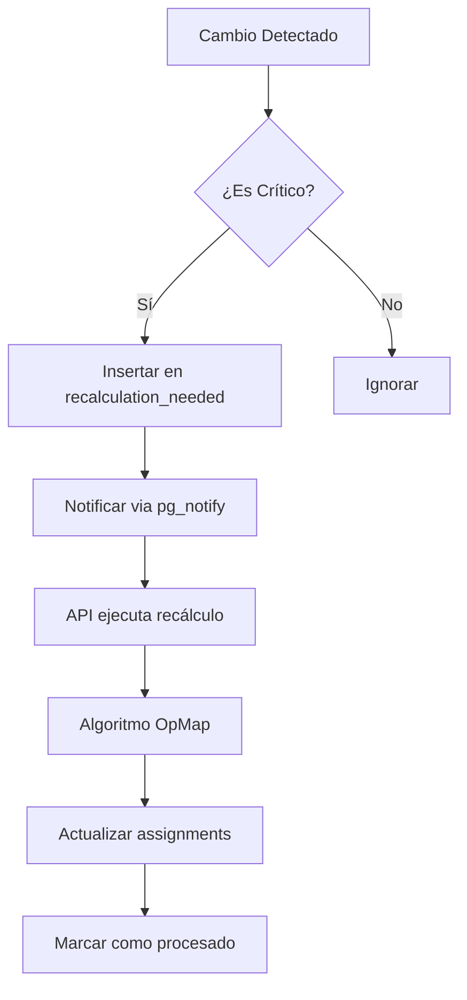

# 🔄 Sistema de Recálculo Automático - OpMap

## 📋 Descripción General

El sistema de recálculo automático garantiza que las asignaciones de hospitales a KAMs se mantengan óptimas y actualizadas ante cualquier cambio crítico en el sistema.

## 🎯 Eventos que Disparan Recálculo

### 1. **Cambios en Hospitales** 🏥
- ✅ **Creación** de nuevo hospital
- ✅ **Activación** de hospital inactivo
- ✅ **Desactivación** de hospital activo
- ✅ **Eliminación** de hospital
- ✅ **Modificación de ubicación** (lat/lng)
- ✅ **Cambio de municipio/departamento/localidad**

### 2. **Cambios en KAMs** 👤
- ✅ **Creación** de nuevo KAM
- ✅ **Activación** de KAM inactivo
- ✅ **Desactivación** de KAM activo
- ✅ **Eliminación** de KAM
- ✅ **Modificación de ubicación** (lat/lng)
- ✅ **Cambio de área base** (area_id)
- ✅ **Modificación de enable_level2**
- ✅ **Cambio de max_travel_time**

### 3. **Cambios en Geografía** 🗺️
- ✅ **Modificación de adyacencias** departamentales
- ✅ **Cambio en exclusión** de departamentos

## 🏗️ Arquitectura del Sistema

### APIs Implementadas

#### 1. `/api/hospital-operations`
```typescript
POST {
  action: 'create' | 'activate' | 'deactivate' | 'update',
  hospitalId?: string,
  hospitalData?: {
    code, name, department_id, municipality_id,
    lat, lng, beds, active, etc.
  }
}
```

#### 2. `/api/kam-operations`
```typescript
POST {
  action: 'create' | 'activate' | 'deactivate' | 'update',
  kamId?: string,
  kamData?: {
    name, area_id, lat, lng,
    enable_level2, max_travel_time, priority, etc.
  }
}
```

#### 3. `/api/check-recalculation`
```typescript
GET/POST
// Verifica cambios pendientes y ejecuta recálculo si es necesario
```

### Triggers de Base de Datos

```sql
-- Detectan cambios críticos automáticamente
trg_hospital_changes ON hospitals
trg_kam_changes ON kams
trg_adjacency_changes ON department_adjacency
trg_department_changes ON departments
```

### Tabla de Control

```sql
recalculation_needed {
  id: uuid,
  reason: text,          -- Descripción del cambio
  triggered_by: text,    -- Tabla.Operación
  triggered_at: timestamp,
  processed: boolean,
  processed_at: timestamp
}
```

## 🔧 Funcionamiento

### Flujo de Recálculo



### Optimizaciones

1. **Detección Inteligente**: Solo cambios críticos disparan recálculo
2. **Caché de Rutas**: Usa `travel_time_cache` antes de Google Maps
3. **Procesamiento por Lotes**: Múltiples cambios se procesan juntos
4. **Notificaciones**: Sistema notifica cambios via WebSocket (opcional)

## 📊 Reglas de Negocio Respetadas

### 1. Exclusión de Departamentos
```typescript
// Departamentos excluidos nunca participan
WHERE departments.excluded = false
```

### 2. Territorio Base Garantizado
```typescript
// Asignación automática sin competencia
if (hospital.municipality_id === kam.area_id)
```

### 3. Proximidad Geográfica
```typescript
// Nivel 1: Departamento + adyacentes
// Nivel 2: Si enable_level2, incluye vecinos de vecinos
```

### 4. Límite de Tiempo
```typescript
// Respeta max_travel_time individual de cada KAM
if (travelTime <= kam.max_travel_time)
```

### 5. Regla de Mayoría
```typescript
// En zonas compartidas, gana el KAM con más hospitales
winner = kamWithMostHospitals(zone)
```

## 🚀 Uso

### Desde la Interfaz

1. **Editar Hospital/KAM**: Cambios se aplican y recalculan automáticamente
2. **Activar/Desactivar**: Un clic recalcula todo el sistema
3. **Crear Nuevo**: Asignación inmediata tras creación

### Verificación Manual

```bash
# Verificar recálculos pendientes
curl GET /api/check-recalculation

# Forzar recálculo completo
curl POST /api/recalculate-assignments
```

### Monitoreo

```sql
-- Ver cambios pendientes
SELECT * FROM recalculation_needed WHERE processed = false;

-- Historial de recálculos
SELECT * FROM recalculation_needed ORDER BY triggered_at DESC;
```

## ⚡ Performance

- **Tiempo promedio de recálculo**: 3-5 segundos
- **Rutas en caché**: 15,000+
- **Nuevas rutas por recálculo**: ~50 máximo
- **Costo Google Maps**: ~$0.25 por recálculo completo

## 🔒 Garantías del Sistema

1. ✅ **Consistencia**: Asignaciones siempre óptimas
2. ✅ **Trazabilidad**: Todo cambio queda registrado
3. ✅ **Eficiencia**: Solo recalcula cuando es necesario
4. ✅ **Confiabilidad**: Usa tiempos reales de Google Maps
5. ✅ **Escalabilidad**: Preparado para crecimiento

## 🛠️ Mantenimiento

### Limpiar Recálculos Antiguos
```sql
DELETE FROM recalculation_needed 
WHERE processed = true 
AND processed_at < NOW() - INTERVAL '30 days';
```

### Verificar Integridad
```sql
-- Hospitales sin asignar que deberían tener asignación
SELECT h.* FROM hospitals h
LEFT JOIN assignments a ON h.id = a.hospital_id
WHERE h.active = true 
AND a.id IS NULL
AND h.department_id NOT IN (
  SELECT code FROM departments WHERE excluded = true
);
```

## 📝 Notas Importantes

- **NUNCA** se usa Haversine para cálculos de tiempo
- **SIEMPRE** se consulta `travel_time_cache` primero
- **Cambios no críticos** (ej: teléfono, email) NO disparan recálculo
- **Recálculo es atómico**: O se actualiza todo o nada
- **Límite de API**: Máximo 50 rutas nuevas por recálculo

---
*Sistema implementado siguiendo las especificaciones exactas del algoritmo OpMap*